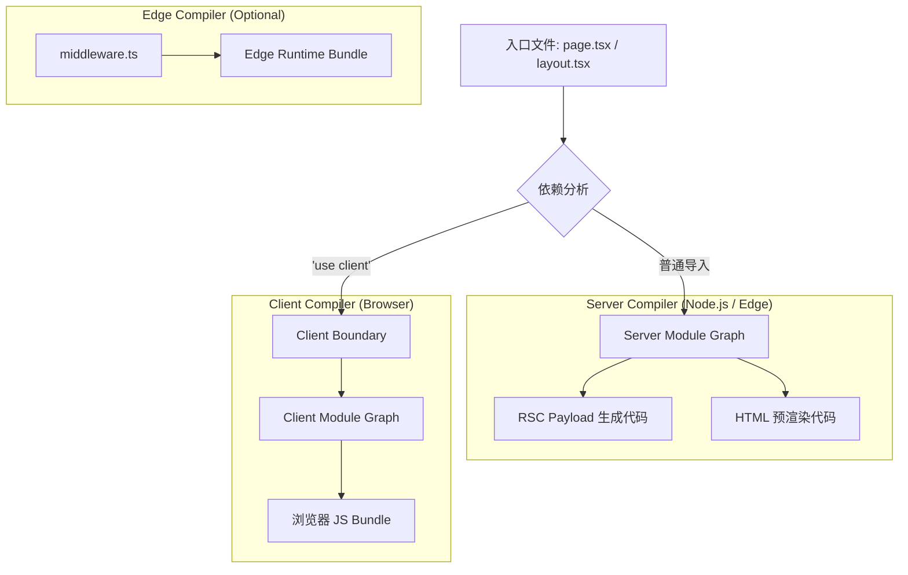

# Next.js 内部构建体系与分层逻辑解析 (Webpack / Turbopack)

Next.js 的构建系统不仅仅是一个简单的打包工具配置，而是一个复杂的**多编译器编排系统（Multi-Compiler Orchestration System）**。为了支持 React Server Components (RSC)、SSR、Edge Runtime 和 Client CSR，Next.js 在内部维护了多套独立的构建流水线。

本文档详细解析 Next.js 如何利用 Webpack（及下一代 Turbopack）实现这种分层构建逻辑。

---

## 1. 核心架构：多重宇宙（Parallel Compilers）

当你在 Next.js 中运行 `next build` 或 `next dev` 时，底层并不是运行了一个 Webpack 实例，而是**至少两个（甚至三个）并行运行的编译器实例**。

### 1.1 分层逻辑图解



### 1.2 三大编译器层级

1.  **Server Compiler (服务器端编译器)**
    *   **目标环境**：Node.js 或 Edge Runtime。
    *   **职责**：处理所有的 Server Components (`page.tsx`, `layout.tsx`)。
    *   **产物**：
        *   用于生成 RSC Payload (JSON 格式的组件树) 的 JS 代码。
        *   用于 SSR (生成初始 HTML) 的 JS 代码。
    *   **特殊处理**：解析 `server-only` 包，剔除 CSS/图片等静态资源（转换为引用路径）。

2.  **Client Compiler (客户端编译器)**
    *   **目标环境**：浏览器 (Browser)。
    *   **职责**：处理所有的 Client Components (标记了 `'use client'` 的文件) 及其依赖。
    *   **产物**：发送到浏览器的 JavaScript Bundles、CSS 文件、静态资源。
    *   **特殊处理**：解析 `client-only` 包，注入 React Fast Refresh (HMR) 代码。

3.  **Edge Compiler (边缘编译器)**
    *   **目标环境**：V8 Isolate (受限环境)。
    *   **职责**：处理 Middleware (`middleware.ts`) 和配置了 Edge Runtime 的 Route Handlers。
    *   **限制**：不能使用 Node.js 原生模块 (fs, path 等)。

#### 代码示例：Edge Middleware
```ts
// middleware.ts
import { NextResponse } from 'next/server';
import type { NextRequest } from 'next/server';

export function middleware(request: NextRequest) {
  // 运行在 Edge Runtime，支持标准 Web API (Request/Response)
  const url = request.nextUrl.clone();
  
  if (url.pathname === '/admin') {
     // 重定向逻辑
     url.pathname = '/login';
     return NextResponse.redirect(url);
  }
  
  // ❌ 错误：Edge 环境没有文件系统访问权限
  // const fs = require('fs'); 
  
  return NextResponse.next();
}
```

---

## 2. 边界处理与清单文件 (Manifests)

Next.js 如何将 Server 层的代码和 Client 层的代码“缝合”在一起？答案是**Manifest 文件**。

### 2.1 模块解析过程
当 Server Compiler 遇到一个导入（Import）：
1.  它会检查该文件是否有 `'use client'` 指令。
2.  **如果有**：Server Compiler **停止**深入解析该文件的依赖，而是将其视为一个**引用（Reference）**。
3.  它会在构建产物中记录一个“占位符”，指向 Client Compiler 生成的对应 Chunk ID。

#### 代码示例：边界跨越
```tsx
// app/page.tsx (Server Component)
// 这里的导入在 Server Layer 实际上只获取了引用
import ClientCounter from './ClientCounter'; 

export default async function Page() {
  // 获取服务端数据
  const initialData = await db.query('SELECT count FROM stats');
  
  return (
    <main>
      <h1>Dashboard</h1>
      {/* 
         跨越边界传递数据：
         props 必须是可序列化的 (Serializable)。
         例如：函数不能直接作为 prop 传递给 Client Component。
      */}
      <ClientCounter count={initialData.count} />
    </main>
  );
}
```

### 2.2 关键 Manifest 文件
构建过程中会生成一系列 JSON 文件，作为运行时 (Runtime) 的导航地图：

*   **`client-reference-manifest.json`**：
    *   **作用**：告诉 Server Component：“当你渲染到 `<MyClientComponent />` 时，请在 HTML 中插入 `<script src="chunk-123.js">`”。
    *   **内容**：映射关系 `{ "ClientComponentModuleID": ["chunk-1.js", "style-1.css"] }`。

*   **`server-actions-manifest.json`**：
    *   **作用**：记录所有的 Server Actions。
    *   **内容**：加密的 Action ID 到内部函数路径的映射，用于安全地路由 POST 请求。

*   **middleware-manifest.json**：
    *   **作用**：定义路由匹配规则，告诉服务器哪些请求需要经过 Middleware。

---

## 3. 深入解析：三大 Layer 环境的异同

Next.js 的分层不仅仅是逻辑上的，它们对应的底层 JavaScript 运行时环境（Runtime Environment）有着本质的区别。理解这些区别对于编写兼容性代码至关重要。

| 特性 | **Client Layer** | **Server Layer (Node.js)** | **Edge Layer (Edge Runtime)** |
| :--- | :--- | :--- | :--- |
| **运行时引擎** | Browser JS Engine (V8, SpiderMonkey, JSC) | Node.js (V8) | Edge Runtime (基于 V8 的轻量级子集) |
| **全局对象** | `window`, `document`, `navigator` | `global`, `process` | `Request`, `Response`, `fetch` (Web Standards) |
| **文件系统 (fs)** | ❌ 不可用 | ✅ 完全支持 (`fs`, `path`) | ❌ 不可用 |
| **Node.js API** | ❌ 不可用 | ✅ 完全支持 (`crypto`, `stream` 等) | ⚠️ 部分支持 (`AsyncLocalStorage`, `EventEmitter`) |
| **npm 包兼容性** | 仅限浏览器兼容包 | 所有 Node.js 包 | 仅限无原生依赖且非 Node 专属 API 的包 |
| **执行时机** | 用户交互时 (Hydration 后) | 构建时 (SSG) 或 请求时 (SSR) | 请求到达的最边缘节点 (低延迟) |
| **典型用途** | 交互组件, `onClick`, `useEffect` | 数据获取, 数据库连接, 渲染 HTML | Middleware, 简单鉴权, 路由重写, 地理位置处理 |
| **冷启动** | 无 (由用户设备加载) | 中 (取决于 Serverless 唤醒) | 极快 (毫秒级) |

### 3.1 环境隔离与“泄漏”防范
Next.js 会在构建时进行静态分析，防止你在错误的环境中使用了错误的 API。
*   如果你在 **Edge Middleware** 中 `import fs from 'fs'`，构建会直接报错。
*   如果你在 **Client Component** 中使用了数据库连接池代码，虽然可能不会立刻报错（如果代码被 Tree-shaking 掉），但这是一个巨大的安全隐患。Next.js 推荐使用 `server-only` 包来显式防止服务端代码泄露到客户端。

#### 代码示例：安全防护
```typescript
// lib/db-access.ts
import 'server-only'; // 🛡️ 核心守卫：一旦被 Client Component 引用，构建即失败

export async function getSensitiveData() {
  // 这里的代码只会在 Node.js 环境执行
  const apiKey = process.env.API_KEY; 
  if (!apiKey) throw new Error("Missing API Key");
  
  return fetch('https://api.internal/secret', {
    headers: { Authorization: `Bearer ${apiKey}` }
  });
}
```

### 3.2 核心误区：Client Component 的“双重渲染”与 `use client`

#### 1. 关于 `'use client'` 的正确理解

很多开发者看到 `'use client'` 就会认为：“这个组件只在浏览器端运行”。**这是完全错误的。**

*   **真正的含义**：`'use client'` 声明了一个**边界（Boundary）**。它告诉 Next.js：“从这个文件开始（包括它导入的所有子组件），进入客户端模块图谱（Client Module Graph）”。
*   **不仅仅是 CSR**：被标记为 `'use client'` 的组件，**依然会在服务端被执行一次**，用于生成初始 HTML（SSR）。

#### 2. 双重渲染机制
"Client Component" 这个名字往往会误导开发者，认为它**只**在浏览器端运行。这是一个巨大的误解。

**真相是：Client Components 在初始加载时会运行在服务端。**

1.  **预渲染阶段 (Pre-rendering / SSR)**：
    *   为了保证首屏加载速度 (FCP) 和 SEO，Next.js 会在服务端将 Client Component 预渲染成静态的 HTML。
    *   **注意**：此时组件处于“非交互状态”。`useEffect` 等 Hook **不会**执行，但组件的主体渲染函数（Render Function）**会**执行。
    *   这就是为什么你不能在 Client Component 的顶层直接使用 `window` 对象（如 `window.localStorage`），因为服务端没有 `window`，会导致报错 `window is not defined`。

2.  **注水阶段 (Hydration)**：
    *   浏览器下载 JS Bundle 后，React 会在客户端再次执行组件逻辑，将事件监听器绑定到服务端生成的 HTML 上。
    *   此时，`useEffect` 开始执行，组件变为完全可交互状态。

**简单验证：**
如果你在 Client Component 中写一行 `console.log('Rendering...')`：
*   **刷新页面**：你会看到**终端（Server）**和**浏览器控制台（Client）**都打印了这句话。
*   **路由跳转**：如果是通过 `Link` 单页导航（SPA 行为）进入该页面，则只会在浏览器执行。

#### 代码示例：安全访问 Browser API
```tsx
// components/SafeWindow.tsx
'use client';

import { useState, useEffect } from 'react';

export default function SafeWindow() {
  // ⚠️ 错误：直接在顶层访问 window
  // const width = window.innerWidth; // SSR 报错: window is not defined
  
  const [width, setWidth] = useState(0);

  useEffect(() => {
    // ✅ 正确：useEffect 保证代码仅在浏览器端(Hydration后)执行
    console.log('Hydrated! Accessing window...');
    setWidth(window.innerWidth);
  }, []);

  return (
    <div>
      <p>Window width: {width}</p>
      {/* 这里的 log 在 SSR 时会在服务端终端打印 */}
      {console.log('Rendering SafeWindow Component...')}
    </div>
  );
}
```

#### 3. 实战陷阱：Hydration Mismatch (水合不匹配)

这是初学者最容易遇到的报错之一：`Error: Text content does not match server-rendered HTML.`

*   **原因**：由于 Client Component 在服务端也会运行一次（生成初始 HTML），如果你的渲染结果依赖于**随机性**或**当前时间**，就会导致服务端生成的 HTML 与浏览器端计算的 HTML 不一致。
    *   例如：`<div>{Math.random()}</div>` 或 `<div>{new Date().toLocaleTimeString()}</div>`。
    *   服务端渲染时是 `0.123`，客户端 Hydration 时变成了 `0.456`，React 就会报错。

*   **解决方案**：
    1.  **使用 `useEffect`**：将依赖随机性的逻辑放在 `useEffect` 中，确保只在客户端执行。
    2.  **`suppressHydrationWarning`**：如果是时间戳等无关紧要的差异，可以在标签上添加此属性忽略警告（如 `<time suppressHydrationWarning>{Date.now()}</time>`）。

---

## 4. Webpack vs. Turbopack：架构差异

虽然分层逻辑一致，但两者的实现机制截然不同。

### 4.1 Webpack (当前稳定版)
*   **基于 JavaScript**：大部分构建逻辑用 JS 编写，插件系统丰富。
*   **全量/分块构建**：虽然有 Cache，但本质上还是基于 Module Graph 的全量计算或 Page 级的拆分。
*   **瓶颈**：随着项目文件增多，内存占用和构建时间呈线性（甚至指数）增长。

### 4.2 Turbopack (Next.js 16 默认开发编译器)
Turbopack 是用 **Rust** 编写的，专为 Next.js 架构设计。在 Next.js 16 中，Turbopack 已经进入稳定阶段，并成为 `next dev` 的默认编译器（无需 `--turbo` 参数，除非手动禁用）。

*   **函数级增量计算 (Function-level Incremental Computation)**：
    *   Turbopack 内部有一个类似 Excel 的计算引擎。
    *   如果函数 A 的输出被缓存，且输入未变，则直接复用结果。
    *   这种缓存粒度细化到函数调用级别，而非文件级别。

*   **懒构建 (Lazy Bundling)**：
    *   **开发模式 (Dev)**：Turbopack **只编译当前请求页面所需的代码**。
    *   如果你有 1000 个页面，启动 `next dev` 时，它可能只编译了 `app/page.tsx`。
    *   当你点击链接跳转到 `/about` 时，它才会在几毫秒内编译 `/about`。
    *   **对比 Webpack**：Webpack 在 Dev 模式下通常也需要构建较大的内存图谱，启动速度受总文件数影响较大。

*   **Next.js 16 更新**：
    *   提升了内存使用效率。
    *   支持了更多 Webpack loader 的兼容性。
    *   构建速度进一步提升。

---

## 5. 总结：一个请求的构建之旅

当你在浏览器访问 `/about` 时：

1.  **Request**：请求到达 Next.js 服务器。
2.  **Match**：根据 Manifest 匹配路由。
3.  **Server Layer**：
    *   Server Runtime 加载 Server Bundle。
    *   React 渲染组件树。
    *   遇到 Client Component 时，查找 `client-reference-manifest.json`，放入占位符。
4.  **RSC Payload**：生成包含数据和组件树结构的 JSON。
5.  **SSR**：将 RSC Payload + Client Component 的初始 HTML 结合，生成完整 HTML 流。
6.  **Client Layer**：
    *   浏览器接收 HTML。
    *   加载 `client-reference-manifest` 中指定的 JS Bundles。
    *   React Hydration（注水），接管页面交互。

这就是 Next.js 能够同时拥有服务端性能和客户端交互能力的底层秘密。
